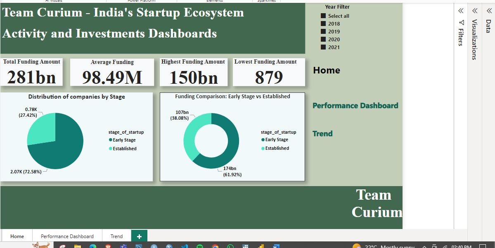
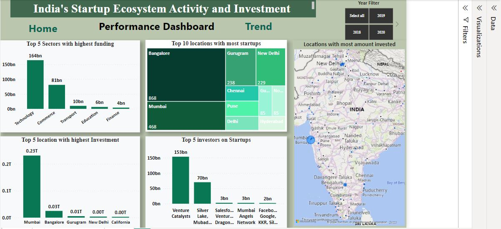
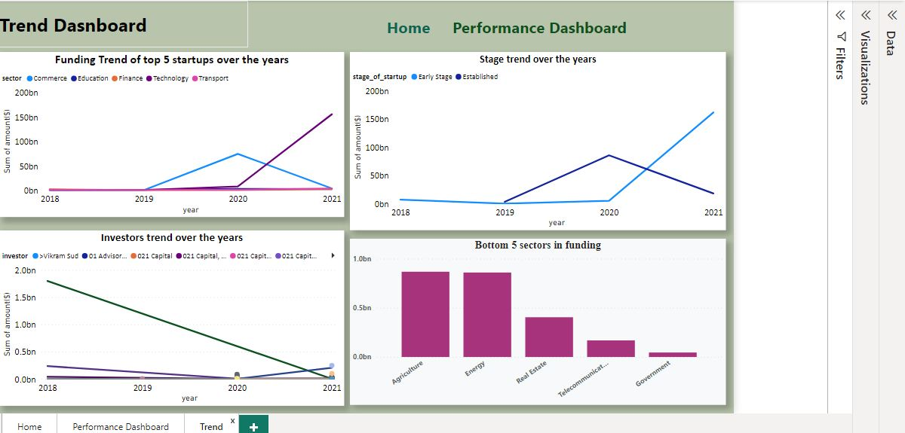

# India's Startup Ecosystem Activity and Investment Analysis
In our endeavor as Team Curium, comprising six dedicated members, we embark on a strategic exploration into the vibrant landscape of the Indian startup ecosystem. Our project, structured under the CRISP-DM framework, encompasses several key phases including Business Understanding, Data Understanding and Preparation, Modelling, Evaluation, and Deployment. Central to our approach is the recognition of Exploratory Data Analysis (EDA) as a foundational step in our analytical journey. Through meticulous EDA, we have delved into the intricacies of the Indian startup ecosystem spanning the years 2018 to 2021. This phase was instrumental for several reasons:

- **Critical Investigation of Data:** Prior to analysis, EDA allowed us to scrutinize the dataset thoroughly, enabling us to identify any anomalies or inconsistencies that could affect the validity of our findings.
- **Data Cleaning** 
- **Trend and Pattern Analysis:** By comparing and contrasting trends and patterns across the datasets from 2018 to 2021, we gained valuable insights into the evolving landscape of the Indian start-up scene.
- **Model Selection:** EDA played a crucial role in the preliminary selection of appropriate models, laying the groundwork for subsequent modelling phases.
Hypothesis Evaluation: Through EDA, we were able to assess how well our data supported both null and alternate hypotheses, guiding the direction of our analysis.
- **Visualization for Stakeholders:** EDA facilitated the creation of informative visualizations, empowering us to address pertinent questions and provide actionable insights to our stakeholders, particularly potential investors.

## INTRODUCTION
As a data analytics professional, I approached the task of exploring datasets spanning 2018 to 2021 within the Indian startup ecosystem with great sensitivity. This exploration aimed to gain a deep understanding of funding dynamics. The project’s primary objective was to dissect the trends shaping the Indian startup landscape and propose actionable strategies. To achieve this, a meticulous exploration was imperative. Delving into the datasets, I meticulously analyzed funding trends over the four-year period, focusing on extracting insights that could inform potential investors’ decisions. This involved leveraging various libraries and techniques, including CSV dataset manipulation and SQL database extraction, to conduct a comprehensive Exploratory Data Analysis (EDA). Through this process, I examined both categorical and numerical variables, scrutinizing their distributions and identifying recurring patterns. Moreover, I paid particular attention to data integrity, addressing issues such as missing values, outliers, and inconsistencies. Additionally, I performed extensive grouping of data, particularly within sectors and stages, to facilitate a more nuanced analysis. This comprehensive EDA provided a solid foundation for the subsequent stages of the project, empowering me to derive meaningful insights and actionable recommendations for investors venturing into the Indian startup ecosystem.

## Tools and Programming Languages Used
- VS Code
- Microsoft PowerBI
- GitHub & Git
- Microsoft SQL Server
- Python
- Jupyter notebook
- SQL
## Python Libraries used
- **Connections:** Pyodbc, dotnev_values, — allowing Python to interact with various database management systems. while dotnev_values allows loading environment variables from a .env file into the environment,
- Analysis: numpy,pandas,regex, statistics,- provides data structures and data analysis tools for working with structured
- **Visualization:** seaborn, matplotlib, wodcloud, scipy- plotting graphs, facilitating easy visualization of datasets.
- **Statistical tests:** ttest_ind, — Provides functions for performing independent two-sample t-tests,
- **Warnings:** warnings- Allows for the issuance of warning messages in Python, providing a flexible mechanism for alerting users to potential issues or unusual conditions during program execution.

## Columns in our dataset
 **Column**             **Dtype**   
- company_brand         object 
- founded               float64
- headquarter           object
- sector                object 
- what_it_does          object
- founders              object
- investor              object 
- amount                object 
- stage                 object 
- year                  int64

### Business Questions

1. What sectors have shown the highest growth in terms of funding received over the past four years?

2. What locations within India have emerged as the primary hubs for startup activity and investment, and what factors contribute to their prominence?

3. Are there any notable differences in funding patterns between early-stage startups and more established companies?

4. Which sectors recieve the lowest level of funding and which sectors recieve the highest levels of funding in India.

5. Which investors have more impact on startups over the years?

### Hypothesis Testing

**Null Hypothesis(Ho):** There is no siginificant difference in the amount of funding between startups in India.

**Alternative Hypothesis(Ha):** There is a siginificant difference in the amount of funding between startups in India.

### Conclusion

In India's startup landscape, the technology sector emerges as the frontrunner in terms of receiving the highest levels of funding, closely trailed by the commerce sector. Conversely, the government sector witnesses the lowest influx of funding, with telecommunications following suit. Notably, Mumbai stands out as the prime location for startup investments, with Bangalore following closely behind. These trends underscore the dynamic nature of India's startup ecosystem, highlighting key sectors and geographic locations that attract significant investor interest and drive entrepreneurial growth.

### Power Bi dashboard

